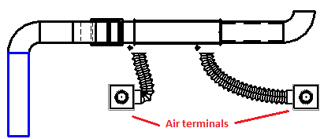
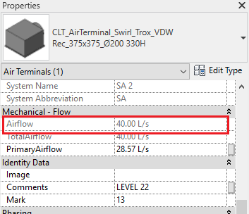
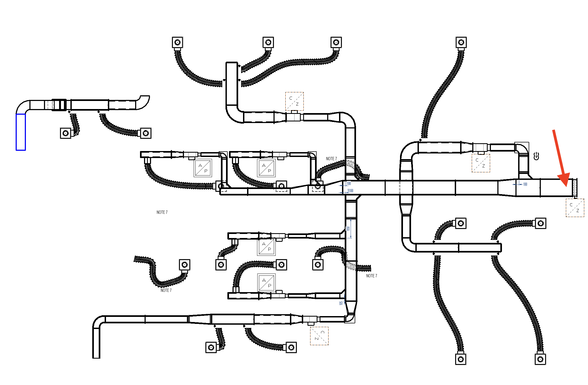

# HVAC System Airflow Calculator Plugin for Revit

The HVAC System Airflow Calculator Plugin is a tool developed for Autodesk Revit that simplifies the process of calculating the total airflow in an HVAC system. This plugin utilizes a graph-based approach and the Depth-First Search (DFS) algorithm to traverse the system and find all connected air terminals.

For example, the following system contains 2 air terminals:



Each air terminal in this system has an airflow value of 40.0 L/S. The total airflow of the system would be 40.0 + 40.0 = 80. In Revit, you can check the airflow value of each air terminal on the properties panel:



An example system is shown in below. If the user selects the element marked with a red arrow, the command calculates the total amount of airflow coming from the air terminals.



## Features

- Easy selection: The user only needs to select the first element of the HVAC system, and the plugin will automatically identify and gather all the connected air terminals.

- Graph-based approach: The plugin treats the HVAC system as a graph, where the air terminals represent nodes and the connections between them represent edges. This approach enables efficient traversal of the system to find all air terminals.

- Depth-First Search (DFS) algorithm: The DFS algorithm is used to recursively explore the graph and identify the air terminals. This algorithm ensures thorough coverage of the system and helps in handling complex HVAC configurations.

## Implementation Details

`TraverseConnections` function recursively searches the graph nodes, finds the `OST_DuctTerminal` nodes and adds them to the `airTerminals` list. It also keeps track of the previously searched nodes using the `visited` set. This function is show in below:

```csharp
private void TraverseConnections(Element element, List<ElementId> airTerminals, HashSet<ElementId> visited)
{
    visited.Add(element.Id);

    // Check if the element is an air terminal
    if (IsAirTerminal(element))
    {
        airTerminals.Add(element.Id);
    }

    // Get connected elements
    var connectorSet = GetConnectors(element);

    if (connectorSet != null)
    {
        foreach (var connector in connectorSet)
        {
            var castConn = connector as Connector;

            var nextElems = GetNextConnectedElements(castConn, element, visited);

            foreach (var nextElem in nextElems)
            {
                TraverseConnections(nextElem, airTerminals, visited);
            }

        }
    }
}
```

### Note:

The HVAC System Airflow Calculator Plugin uses the Depth-First Search (DFS) algorithm, one of the two common graph search algorithms. DFS was chosen for this plugin because it ensures that every node of the HVAC system graph is checked during traversal. While the other algorithm, Breadth-First Search (BFS), is typically used for finding the shortest path, DFS is more suitable for exhaustively exploring the graph structure and identifying all connected air terminals.